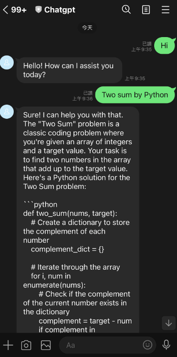
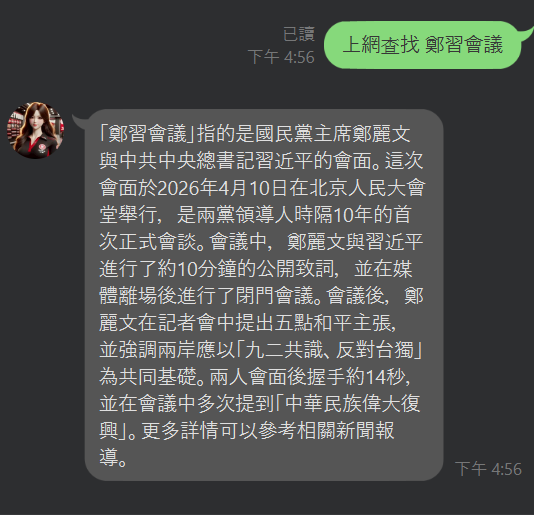
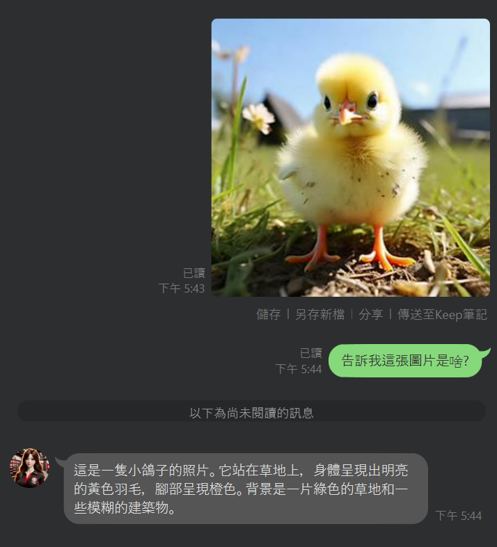

# LINE Agent Bot

一個住在 LINE 裡的 AI 助理。會寫程式、跑指令、查網路、產圖產片、看圖回答，並且記住每個使用者的偏好。

底層不是手刻的 function-calling 迴圈，而是把 **Claude Code CLI 當成 agent harness 封裝起來，
接上免費的 GLM 模型**，並且把整個 agent 鎖在 `workspace/` 沙箱裡，碰不到專案原始碼。

**完全免費**——模型、搜尋、部署都有免費方案，不需要信用卡。

```
你 > 算 1 到 100 所有質數的總和，跑 python 確認
AI > 1060
  · run_shell python primes.py
  [10.2s]
```

## ✨ 功能

<table>
<tr>
<td width="50%" valign="top">

**自然語言對話**

記得你說過的話，也記得你的偏好。



</td>
<td width="50%" valign="top">

**在線連網查詢**

即時新聞、股價、天氣、時事。免費、不需要 API Key。



</td>
</tr>
<tr>
<td valign="top">

**圖片生成**

「生成一隻貓的圖片」


</td>
<td valign="top">

**在線圖片搜尋**

「幫我找台北101的照片」


</td>
</tr>
<tr>
<td valign="top">

**圖片推理**

傳張圖片，再問圖裡有什麼。



</td>
<td valign="top">

**文字生成影片**

「生成一段貓在走路的影片」


</td>
</tr>
<tr>
<td valign="top">

**圖片生成影片**

傳圖片後說「根據這張圖生成影片」。


</td>
<td valign="top">

**寫程式與處理檔案**

算數、整理資料、產報表——實際跑程式，不是心算。


</td>
</tr>
</table>

還有：定時推播（`POST /broadcast`，接 cron 即可）、技能系統（放進 `skills/` 就會被載入）。

> 有任何功能請求，歡迎開 Issue 或 PR。

## 🚀 開始使用

**[→ 部署指南](docs/deployment.md)** — 取得金鑰、Fork、連到 Render、設環境變數，一份文件講完。

想先在本機玩：

```bash
npm install -g @anthropic-ai/claude-code   # agent harness 本體
poetry install
cp .env.example .env                       # 填入 GLM_API_KEY
python main.py

python scripts/test_agent.py chat          # 互動對話
```

## 💬 怎麼用

| 情境 | 做法 |
|---|---|
| 一對一 | 直接講話，任何訊息都會回 |
| 群組 | 用 `@` tag 這個機器人，例如 `@機器人 今天天氣如何`；也可以用 `@chat` 前綴 |
| 不知道能做什麼 | 打 `@help` |
| 想換個性 | `@prompt 你是一個個性溫和的助理` |
| 重開對話 | `@init`（保留記憶）／ `@forget`（連記憶一起清） |

完整說明見 [使用方式](docs/usage.md)。

## 🏗️ 架構

```
LINE ──► line_bot/routes.py ──┐
                              ├──► agent_core/runner.py ──► claude CLI ──► GLM
HTTP ──► api/agent_api.py ────┘         │
                                        └── guard.py（沙箱）· tools.py（自訂工具）
                                            memory.py · prompt.py · workspace.py
```

agent 有完整的檔案讀寫與 shell 能力，但只能在自己的工作目錄活動——四層防線加 48 個測試守著這條線。

## 📖 文件

| 文件 | 內容 |
|---|---|
| [部署指南](docs/deployment.md) | 金鑰取得、Render 部署、環境變數、本機開發 |
| [架構設計](docs/architecture.md) | 模組職責、資料流、關鍵設計決策 |
| [沙箱機制](docs/sandbox.md) | 四層防線、權限範圍、已知限制 |
| [效能調校](docs/performance.md) | 工具數量與快取如何決定延遲（含實測數據） |
| [設定項](docs/configuration.md) | 所有環境變數與工具 profile |
| [使用方式](docs/usage.md) | LINE 指令、REST endpoints、測試工具 |

## 🔨 技術棧

| | |
|---|---|
| Agent harness | [claude-agent-sdk](https://github.com/anthropics/claude-agent-sdk-python) + Claude Code CLI |
| 模型 | [GLM-4.7-Flash](https://docs.bigmodel.cn)（免費）· CogView · CogVideoX · GLM-4V |
| 服務 | Python 3.11+ · FastAPI · uvicorn |
| 搜尋 | duckduckgo-search（免費，無需 API Key）· iCrawler · SerpAPI（選用） |
| LINE | line-bot-sdk |
| 部署 | Docker · Render / ngrok · cron-job.org |

## License

MIT
