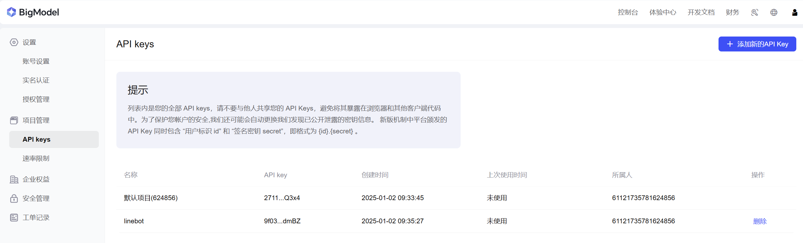
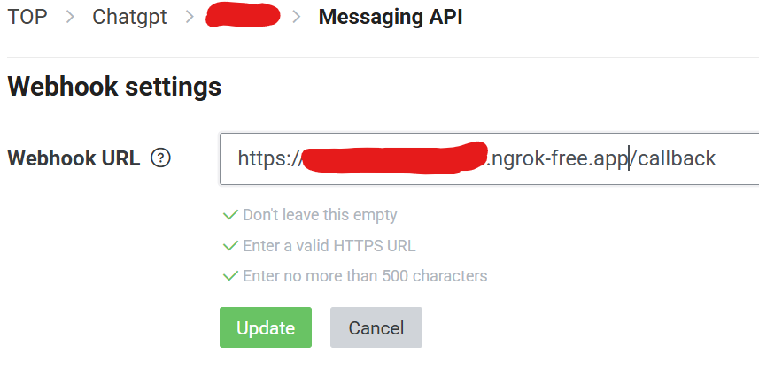
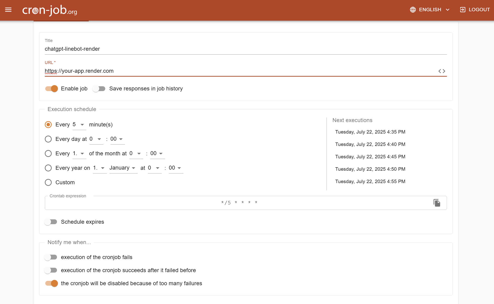
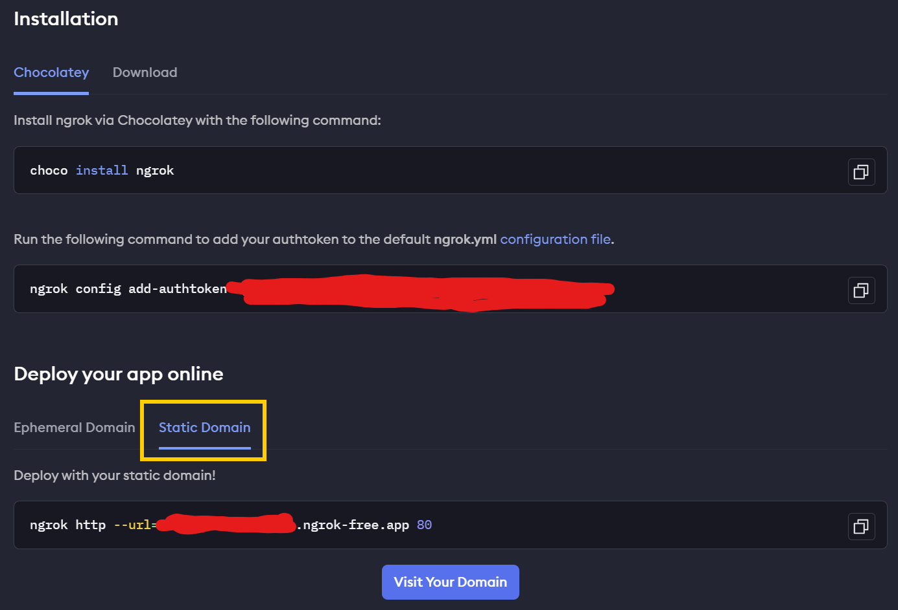

# 部署到 Render

從零到一個能用的 LINE Bot。照著做完就會通。

**流程**：取得金鑰 → Fork 專案 → Render Blueprint → 掛磁碟 → 確認健康 → 設 Webhook → 加好友 → 防休眠

---

## 步驟 1：取得三個金鑰

### 1-1. GLM API Key（AI 大腦，免費）

1. 前往 [BigModel 智譜開放平台](https://open.bigmodel.cn/) 註冊
2. 進入 [API Keys 管理頁](https://open.bigmodel.cn/usercenter/proj-mgmt/apikeys)
3. 點「新增 API Key」，複製產生的字串



免費、不需要信用卡。這把金鑰同時用於：對話（`glm-4.7-flash`）、圖片生成（`cogview-3-flash`）、
影片生成（`cogvideox-flash`）、圖片理解（`glm-4v-flash`）。

### 1-2. LINE Channel 金鑰（兩個）

1. 登入 [LINE Developers](https://developers.line.biz/en/)
2. 建立 `Provider` → 點 **Create**
3. 建立 `Channel` → 選 **Create a Messaging API channel** → 填基本資料
4. 進入 **Basic settings** → 找到 `Channel secret` → 這是 `LINE_CHANNEL_SECRET`
5. 進入 **Messaging API** → `Channel access token` 點 **Issue** → 這是 `LINE_CHANNEL_ACCESS_TOKEN`

順便在 **Messaging API** 頁面關掉「自動回應訊息」，否則官方罐頭訊息會蓋掉 bot 的回覆。

### 1-3. SerpAPI Key（選用）

只影響圖片搜尋的備援。免費爬蟲找不到圖時才會用到，可以先跳過。
需要的話去 [serpapi.com](https://serpapi.com/) 註冊。

---

## 步驟 2：Fork 專案

1. 登入 [GitHub](https://github.com/)
2. 打開本專案頁面，點右上角 **Fork**
3. 這樣你就有一份自己的副本，Render 會從它部署

---

## 步驟 3：在 Render 用 Blueprint 建立服務

> **Runtime 必須是 Docker。** Render 原生的 Python 環境沒有 Node，而這個 agent 的核心是
> `claude` CLI（Node 程式），裝不起來。

專案根目錄的 `render.yaml` 已經把 runtime、region、health check、環境變數全部寫好了，
所以用 **Blueprint** 部署——不用在網頁上一項一項填，也不會漏設定。

### 3-1. 建立 Blueprint Instance

1. 前往 [Render](https://render.com/) 註冊並登入
2. 左側選單點 **Blueprints**（不是 New + → Web Service）
3. 點右上角 **New Blueprint Instance**
4. **Connect a repository** 區塊裡選你 fork 的 repo
   - 第一次使用要先按 **GitHub** 授權，並允許 Render 存取該 repo
   - 找不到 repo 的話點 **Configure account** 調整授權範圍
5. Render 會讀取 repo 根目錄的 `render.yaml` 並顯示它即將建立的資源，
   應該只有一個 web service：`agent-line-bot`

### 3-2. 填入密鑰

`render.yaml` 裡標了 `sync: false` 的變數不會存在 git，所以這一步 Render 會直接跳出欄位要你填：

| 欄位 | 貼上 |
|---|---|
| `GLM_API_KEY` | 步驟 1-1 的金鑰 |
| `LINE_CHANNEL_SECRET` | 步驟 1-2 的 Channel secret |
| `LINE_CHANNEL_ACCESS_TOKEN` | 步驟 1-2 的 Channel access token |

其他變數（`AGENT_TIMEZONE`、`AGENT_TOOL_PROFILE`…）已經寫在 `render.yaml` 裡，不用填。

### 3-3. Apply

1. 上方 **Blueprint Name** 可以隨便取，只是給你自己看的
2. 點 **Apply** / **Create Resources**
3. Render 開始 build，跳到步驟 [盯第一次 build](#盯第一次-build)

### 已經有服務要轉成 Docker

如果你之前手動建過 Web Service、而且是原生 Python runtime
（Build Command 是 `poetry install`、Start Command 是 `python main.py`），
**不要重建**——用 Blueprint 接管就好，服務網址會保留。

> **Dashboard 不能改 runtime。** 官方文件寫得很明確：
> *"Changing a service's runtime in the Render Dashboard is not currently supported."*
> Settings → Build → Source → **Edit** 那個 **Update Source** 對話框裡只有
> Git Provider / Public Git Repository / Existing Image 三個頁籤，**沒有 Runtime 欄位**。
> 但 Blueprint 可以改。

做法：

1. 先確認 `render.yaml` 的 `name` 與現有服務名稱**完全相同**
   （預設是 `agent-line-bot`；不同就把 `render.yaml` 改成你的服務名）
2. 依照 [3-1](#3-1-建立-blueprint-instance) 建立 Blueprint Instance，選同一個 repo
3. Render 會偵測到同名服務，顯示為 **update** 而不是 create
4. **Apply** 之後它會把 runtime 換成 docker 並重新部署

如果你偏好用 API：

```bash
curl -X PATCH https://api.render.com/v1/services/<SERVICE_ID> \
  -H "Authorization: Bearer <RENDER_API_KEY>" \
  -H "Content-Type: application/json" \
  -d '{"serviceDetails":{"runtime":"docker"}}'
```

`SERVICE_ID` 在服務頁面的網址裡（`srv-` 開頭），API key 在
**Account Settings → API Keys** 產生。

---

## 步驟 4：環境變數對照表

用 Blueprint 的話這一步已經做完了，這裡只是給你查對照。
之後要改就到服務的 **Environment** 分頁。

### 必填（Blueprint 會跳出來問）

| Key | Value | 來源 |
|---|---|---|
| `GLM_API_KEY` | `你的金鑰` | 步驟 1-1 |
| `LINE_CHANNEL_SECRET` | `你的 secret` | 步驟 1-2 |
| `LINE_CHANNEL_ACCESS_TOKEN` | `你的 token` | 步驟 1-2 |

### 建議填（`render.yaml` 已預設）

| Key | 建議值 | 說明 |
|---|---|---|
| `AGENT_TIMEZONE` | `Asia/Taipei` | 影響 bot 認為的「今天」 |
| `AGENT_WORKSPACE_ROOT` | `/data/workspace` | 持久化磁碟的掛載點，見步驟 5 |

#### 不設 `AGENT_WORKSPACE_ROOT` 會怎樣？

**不會壞掉，但記憶不會留下來。**

`Dockerfile` 裡已經預設 `AGENT_WORKSPACE_ROOT=/data/workspace`，所以不設也會用那個路徑；
本機執行（沒有 Docker）則落在專案目錄下的 `workspace/`。目錄不存在會自動建立，
所以功能一切正常。

差別在**持久性**：如果 `/data` 沒有掛持久化磁碟，那個目錄只存在於容器裡，
**每次部署或重啟就清空**——所有使用者的 `MEMORY.md`、`PERSONA.md`、產出的檔案全部消失，
bot 會忘記所有人。

判斷方法是打開 `/agent/health` 看 `sandbox` 區塊：

```json
"sandbox": {
  "workspace_root": "/data/workspace",
  "workspace": "writable",
  "survives_redeploy": true
}
```

- `workspace` 不是 `writable` → 路徑設錯或磁碟沒掛好，`problems` 會直接說明
- `survives_redeploy` 是 `false` → 工作區在應用程式目錄裡，部署一次就全沒了

### 選填

| Key | 預設 | 說明 |
|---|---|---|
| `SERPAPI_API_KEY` | — | 圖片搜尋備援 |
| `AGENT_TOOL_PROFILE` | `files` | 工具範圍，影響速度 |
| `AGENT_THINKING` | `false` | 開了會慢 5 倍 |
| `AGENT_MAX_TURNS` | `30` | 單輪最多幾步 |
| `GLM_FREE_MODEL` | `glm-4.7-flash` | 換模型用 |

完整清單見 [設定項](configuration.md)。

> **不要**把 `.env` commit 進 repo。`.gitignore` 已經擋掉了，金鑰一律用 Render 的
> Environment Variables 提供。

按 **Create Web Service**（或 Blueprint 的 **Apply**），等 build 完成。

### 盯第一次 build

第一次約 5-10 分鐘，因為要裝 Node 和所有相依套件。進入服務的 **Logs** 分頁看進度，
依序應該會出現：

| 階段 | log 裡會看到 |
|---|---|
| 裝系統套件 | `Setting up nodejs` |
| 裝 Claude Code CLI | `added N packages` |
| 裝 Python 套件 | `Successfully installed claude-agent-sdk fastapi ...` |
| 啟動 | `Uvicorn running on http://0.0.0.0:8090` |
| 健檢通過 | Render 頁面上狀態轉為綠色的 **Live** |

`[startup] LINE routes disabled:` 這行代表 LINE 憑證沒設好，`/agent/*` 還是能用，
但 bot 不會回話。

build 失敗的話，錯誤通常在裝 Node 那段——把 log 的最後 30 行留下來對照
[疑難排解](#疑難排解)。

---

## 步驟 5：掛持久化磁碟（強烈建議）

Render 的檔案系統是暫時的——**每次部署或重啟都會清空**，所有使用者的 `MEMORY.md` 和
`PERSONA.md` 會消失。

1. 進入服務的 **Disks** 分頁 → **Add Disk**
2. Mount Path 填 `/data`，大小 1GB 就夠
3. 確認 `AGENT_WORKSPACE_ROOT` 是 `/data/workspace`

用 Blueprint 的話，把 `render.yaml` 的 `plan` 改成 `starter`，並把最下面的 `disk:` 區塊
取消註解即可。

持久化磁碟需要付費方案。免費方案的替代方案見[下方](#免費方案的三個限制)。

順帶一提：**掛了磁碟就不能零停機部署**，Render 會先停舊的再起新的。對聊天機器人來說
影響不大。

---

## 步驟 6：確認服務活著

打開 `https://your-app.onrender.com/agent/health`。要看到：

```json
{
  "status": "ok",
  "problems": [],
  "provider": { "api_key_set": true, "model": "glm-4.7-flash" },
  "sandbox": {
    "workspace_root": "/data/workspace",
    "workspace": "writable",
    "survives_redeploy": true
  },
  "claude_cli": "/usr/bin/claude"
}
```

逐項對照：

| 欄位 | 應該是 | 不對的話 |
|---|---|---|
| `status` | `ok` | 看 `problems`，它會直接說缺什麼 |
| `provider.api_key_set` | `true` | `GLM_API_KEY` 沒設或拼錯 |
| `sandbox.workspace` | `writable` | 磁碟沒掛好，或 `AGENT_WORKSPACE_ROOT` 指到唯讀路徑 |
| `sandbox.survives_redeploy` | `true` | 沒掛持久化磁碟，重新部署會忘記所有人（見步驟 5） |
| `claude_cli` | 一個路徑 | image 裡的 CLI 沒裝成功，回頭看 build log |

### 設定 Health Check Path

**Settings** → **Health Checks** → **Health Check Path** 填 `/agent/health`。

Render 會定期打這個路徑，失敗就重啟服務。沒設的話 Render 只看 port 有沒有開，
服務其實壞了也不會知道。用 Blueprint 部署的話這項已經設好了。

---

## 步驟 7：設定 Webhook

1. 回到 LINE Developers → 你的 Channel → **Messaging API**
2. Webhook URL 填 `https://your-app.onrender.com/callback`
3. 打開 **Use webhook**，點 **Verify** 應該顯示 Success
4. 同一頁往下確認 **自動回應訊息** 是關閉的，否則官方罐頭訊息會蓋掉 bot 的回覆



---

## 步驟 8：加好友開始用

到 [LINE Official Account Manager](https://manager.line.biz/account) → 選你的 bot →
**加好友工具** → 產生 QR code，掃描加入。

傳一句 `@help` 就會看到功能清單。

---

## 步驟 9：防止服務休眠（免費方案）

免費方案閒置 15 分鐘會休眠，冷啟動要幾十秒，第一則訊息很可能等到 LINE webhook timeout。

用 [cron-job.org](https://console.cron-job.org/jobs)（免費）每 10 分鐘打一次
`https://your-app.onrender.com/agent/health` 保持喚醒。



同一個服務也可以用來定時推播——把 `POST /broadcast` 排程即可，詳見 [使用方式](usage.md#post-broadcast)。

---

## 免費方案的三個限制

**1. 記憶會隨部署消失**

沒有持久化磁碟，`workspace/` 每次重啟就清空。三個選擇：

- 升級到付費方案 + Persistent Disk（最簡單）
- 把 `MEMORY.md` 改存到外部（Supabase / Firestore），要改 `agent_core/memory.py`
- 接受記憶會消失，只當一般問答 bot 用

**2. 會休眠**

見步驟 9。

**3. 512MB RAM 很緊**

實測單個 `claude` 子行程約 300–390MB RSS，加上 Python 服務會接近上限。同時多人使用可能
OOM。真的要穩定就升級 instance。

---

## 疑難排解

先看是**建置階段**還是**執行階段**的問題：Render 服務頁面的 **Events** 分頁會標明是
build failed 還是 deploy failed，**Logs** 分頁才是實際輸出。

| 症狀 | 原因與處理 |
|---|---|
| Build 卡在 / 失敗於 `deb.nodesource.com` | 網路或套件庫暫時性問題，先重試 **Manual Deploy → Clear build cache & deploy** |
| `poetry: not found` 或跑的是 `python main.py` | 服務還是原生 Python runtime，`Dockerfile` 沒被使用。見[轉成 Docker](#已經有服務要轉成-docker) |
| Deploy 成功但 `/agent/health` 回 `degraded` | 看 `problems` 陣列，它會指名缺哪個環境變數 |
| `claude_cli` 是 `null` | image 裡的 CLI 沒裝成功，回頭看 build log 的 `npm install -g` 那段 |
| `sandbox.workspace` 是 `unwritable` | 磁碟沒掛在 `/data`，或 `AGENT_WORKSPACE_ROOT` 指到唯讀路徑 |
| log 出現 `[startup] LINE routes disabled` | LINE 兩個憑證沒設好。`/agent/*` 仍可用，但 bot 不會回話 |
| 傳圖片後她說「我看不了這張圖片」 | 看 log 的 `[describe_image]` 那行會印出真正的錯誤。多半是圖片超過視覺模型的 5MB / 6000px 限制，或三個視覺模型同時被限流 |
| 圖片工具回 `cannot import name 'ZhipuAI' from 'zhipuai'` | image 裡裝到 zhipuai 1.0.7。2.x 把 pyjwt 釘在 `<2.9`，agent SDK 的 `mcp` 要 `>=2.10.1`，pip 就一路退版到沒有 `ZhipuAI` 的 1.0.7。修法是 Dockerfile 用 `pip install --no-deps zhipuai==2.1.5.20250825` 單獨裝，requirements.txt 裡不要列它 |
| LINE Verify 按下去失敗 | 服務在休眠（等 30 秒再按）、或 Webhook URL 漏了 `/callback` |
| Bot 只回官方罐頭訊息 | LINE 的「自動回應訊息」沒關掉 |
| Bot 完全不回，log 也沒動靜 | Webhook URL 填錯，或 **Use webhook** 沒打開 |
| 回應要一兩分鐘 | 免費模型的限流。見[效能調校](performance.md) |
| 服務莫名重啟，log 有 `Out of memory` | 512MB 不夠，升級 instance |
| 部署後 bot 忘記所有人 | 沒掛持久化磁碟，見步驟 5 |

改完環境變數要按 **Manual Deploy → Deploy latest commit** 才會生效。

---

## 本機開發

不部署也能跑，方便改人設和測功能。

```bash
npm install -g @anthropic-ai/claude-code   # agent harness 本體
poetry install
cp .env.example .env                       # 填入 GLM_API_KEY
python main.py
```

```bash
python scripts/test_agent.py health        # 確認設定
python scripts/test_agent.py chat          # 互動對話
```

沒填 LINE 憑證也能跑，`/agent/*` 照常運作。

要接真的 LINE 測試，webhook 需要公開 HTTPS：

```bash
ngrok http 8090
```



把 `https://xxxx.ngrok-free.app/callback` 填進 LINE 的 Webhook URL。

> **Windows**：本機開發若要開熱重載請用 `RELOAD=true`。不開的話預設是關閉的——
> uvicorn 在 Windows 上啟用 reload 會換成不支援子行程的 event loop，
> `runner.py` 已經繞過這個問題，但保持關閉還是比較快。

---

## 容器化的額外好處

除了讓 CLI 裝得起來，容器也是[沙箱](sandbox.md#已知限制)真正硬化的方式：只掛載
`workspace/`，其他檔案系統對 agent 根本不存在，就不需要依賴指令字串分析。

如果安全性是主要考量，容器化的價值比部署便利性更高。
